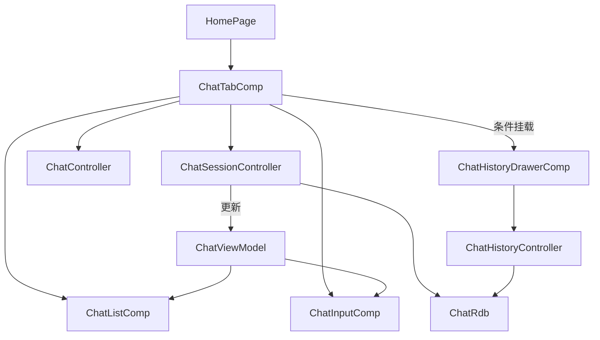

# HarmonyOS 聊天重构：从双页面跳转到单入口右侧抽屉

> 系列第 1 篇。本文不急着写抽屉动画，而是先解决一个更重要的问题：聊天 Tab、独立聊天页和历史页同时存在时，究竟谁拥有“当前会话”？

## 一、需求表面是抽屉，底层是状态所有权

原来的 Demo 有三个与聊天相关的入口：

- 首页中的 `ChatTabComp`；
- 独立的 `ChatPage`；
- 从“我的 → 消息记录”进入的 `ChatHistoryPage`。

用户从历史列表选择会话时，需要离开历史页、返回首页、切换 Tab，再让聊天组件加载对应会话。

产品体验上的目标很简单：历史记录就在聊天页右侧，点一下直接切换。但如果只把 `ChatHistoryPage` 的 UI 复制到 `ChatTabComp`，会得到一个体积很大的组件，同时留下旧页面、旧路由和旧全局信号。视觉变了，状态结构却更混乱。

所以这次重构先确定一条架构约束：

> `ChatTabComp` 是唯一聊天入口，也是当前 `ChatViewModel` 的唯一所有者。

抽屉不创建第二份当前会话状态，只展示会话摘要并向父组件上报用户意图。

## 二、先还原旧架构

旧架构中的 `ChatLoadState` 是一个基于 `AppStorageV2` 的全局临时信号：

```ts
@ObservedV2
export class ChatLoadState {
  @Trace pendingSessionId: string = ''
  @Trace deletedSessionId: string = ''
}
```

它解决的是“两个没有父子关系的页面如何通信”：

```text
ChatHistoryPage
  ├─ 点击会话：pendingSessionId = session.id
  ├─ 删除会话：deletedSessionId = session.id
  └─ pop 回 HomePage

HomePage / ChatTabComp
  ├─ @Monitor pendingSessionId
  ├─ 切换到 AI Tab
  ├─ 加载消息
  └─ 把信号重新清空
```

旧方案的问题不在于 `AppStorageV2`，而在于它承担了本可由父子事件完成的通信。

### 2.1 一次操作需要多个隐式前提

选择会话成功依赖：

1. 历史页正确写入 ID；
2. 路由正确返回；
3. 首页监听器正确切换 Tab；
4. 聊天组件监听器被触发；
5. 消费完成后必须清空 ID。

其中任何一步遗漏，UI 都可能停留在旧会话。

### 2.2 相同 ID 再次赋值可能不触发响应

响应式系统通常根据值变化触发更新。如果消费后不清空：

```ts
this.chatLoadState.pendingSessionId = 'session-100'
```

下一次再选择同一个 ID，值没有变化，监听逻辑可能不会重新执行。因此旧代码中到处存在“处理后清空信号”的约定。

约定越多，维护者越容易漏掉。

### 2.3 两套聊天界面会产生双重状态所有者

`ChatTabComp` 和 `ChatPage` 都创建自己的 `ChatViewModel`、`ChatController`、`ChatSessionController` 和键盘监听器。即使 UI 很相似，它们也是两个独立运行的聊天容器。

这会带来几个问题：

- 同一个会话在两个页面中可能呈现不同运行时状态；
- 流式请求属于哪一个页面不够直观；
- 键盘、安全区和主题修复需要改两份；
- 历史页究竟返回 Tab 还是 push 独立聊天页，很容易继续分叉。

## 三、三种可选方案

### 方案 A：继续保留独立历史页

优点是改动小，适合历史列表非常复杂、需要独立搜索和批量管理的产品。

缺点是当前 Demo 的主要动作只是“快速重回会话”，路由往返让操作变重，而且仍要维护跨页面状态同步。

### 方案 B：使用系统侧边栏容器

可以考虑 `SideBarContainer` 一类系统组件。它适合导航栏长期占据一侧的平板或桌面布局。

当前需求是手机上的覆盖式临时抽屉：需要半透明遮罩、80% 宽度、点击外部关闭，并且不能压缩聊天内容。系统侧边栏并不完全匹配交互目标。

### 方案 C：`Stack` 覆盖层 + 独立抽屉组件

最终选择这一方案：

- `ChatTabComp` 根布局改为 `Stack`；
- 原聊天内容仍是一个完整 `Column`；
- 抽屉打开时，在上层条件挂载 `ChatHistoryDrawerComp`；
- 抽屉通过强类型 `@Event` 把操作意图传回父组件；
- 父组件调用现有 Controller 更新同一个 `ChatViewModel`。

它既满足覆盖式交互，也不会重新引入第二套聊天页面。

## 四、最终架构



这里最重要的不是组件数量，而是箭头方向：

- `ChatHistoryDrawerComp` 可以读取历史摘要；
- 它不能直接替换当前聊天状态；
- 当前会话的所有修改都回到 `ChatTabComp → ChatSessionController → ChatViewModel`。

## 五、文件结构与职责

```text
chat/src/main/ets/
├─ components/
│  ├─ ChatTabComp.ets              # 总容器、当前会话、抽屉开关
│  ├─ ChatHistoryDrawerComp.ets    # 历史列表抽屉
│  ├─ ChatListComp.ets             # 消息列表
│  └─ ChatInputComp.ets            # 输入与发送/停止按钮
├─ controller/
│  ├─ ChatController.ets           # 消息收发和流式状态
│  ├─ ChatSessionController.ets    # 当前会话加载/新建/保存
│  └─ ChatHistoryController.ets    # 摘要查询/排序/删除
├─ models/
│  └─ chatModel.ets                # ChatSession、消息模型
├─ utils/
│  └─ ChatRdb.ets                  # RDB 唯一访问入口
└─ viewmodel/
   └─ ChatViewModel.ets            # 当前聊天响应式状态
```

### 5.1 `ChatTabComp`：协调者，不是万能组件

父组件持有四类状态：

```ts
@Local vm: ChatViewModel = new ChatViewModel()
@Local keyboardHeight: number = 0
@Local historyDrawerVisible: boolean = false
@Local sessionOperationPending: boolean = false
```

它还持有负责消息和会话的两个 Controller：

```ts
@Local controller: ChatController = new ChatController(this.vm)
private sessionController: ChatSessionController =
  new ChatSessionController(this.vm)
```

这里使用同一个 `vm` 是关键。发送消息、加载历史会话、新建会话和删除当前会话，最终都作用于这一份状态。

### 5.2 `ChatHistoryDrawerComp`：展示数据并上报事件

抽屉的输入参数：

```ts
@Param visible: boolean = false
@Param isGenerating: boolean = false
@Param operationPending: boolean = false
@Param currentSessionId: string = ''
```

抽屉的输出事件：

```ts
@Event onClose: () => void = () => {}
@Event onSelectSession: (sessionId: string) => Promise<void> =
  (_sessionId: string) => Promise.resolve()
@Event onNewSession: () => void = () => {}
@Event onSessionDeleted: (sessionId: string) => void =
  (_sessionId: string) => {}
@Event onOperationStateChange: (pending: boolean) => void =
  (_pending: boolean) => {}
```

这种接口有两个好处：

1. ArkTS 可以在编译阶段检查参数和返回值，避免 `any`；
2. 抽屉不知道父组件怎样加载会话，因此未来替换存储实现时不用重写 UI。

### 5.3 Controller：把 UI 意图翻译为领域操作

`ChatSessionController` 负责当前会话：

```text
initSession()
loadSessionById()
newSession()
persistSession()
```

`ChatHistoryController` 负责历史摘要：

```text
loadData()
deleteSession()
formatTime()
```

两个 Controller 都会调用 `ChatRdb`，但不会互相复制 SQL。这样 UI 层只需要表达“加载会话”或“删除会话”，不需要知道表名和字段名。

## 六、父子事件如何替代全局信号

父组件挂载抽屉时，把处理函数直接传入：

```ts
if (this.historyDrawerVisible) {
  ChatHistoryDrawerComp({
    visible: true,
    isGenerating: this.vm.isLoading,
    operationPending: this.sessionOperationPending,
    currentSessionId: this.vm.sessionId,
    onClose: () => {
      this.closeHistoryDrawer()
    },
    onSelectSession: (sessionId: string) => {
      return this.selectHistorySession(sessionId)
    },
    onNewSession: () => {
      this.requestNewSession()
    },
    onSessionDeleted: (sessionId: string) => {
      this.onHistorySessionDeleted(sessionId)
    }
  })
}
```

点击某条会话后的调用链缩短为：

```text
ListItem.onClick
  → Drawer.requestSelectSession(sessionId)
  → onSelectSession(sessionId)
  → ChatTabComp.selectHistorySession(sessionId)
  → ChatSessionController.loadSessionById(sessionId)
  → 更新 ChatViewModel
  → 关闭抽屉
```

不需要路由，不需要全局信号，也不需要“消费后清空”。

## 七、为什么抽屉必须拆成独立组件

如果把列表、空状态、左滑删除、遮罩、动画和异步锁全部写进 `ChatTabComp`，父组件会同时包含：

- 流式消息逻辑；
- 键盘适配；
- 顶部栏；
- 当前会话持久化；
- 历史列表展示；
- 删除手势；
- 抽屉动画。

这样的文件很难回答“修改历史列表会不会影响消息发送”。拆出 `ChatHistoryDrawerComp` 后，可以用接口描述边界：

```text
输入：当前会话 ID、生成状态、操作状态、是否显示
输出：关闭、选择、新建、删除完成、操作状态变化
```

组件内部怎样绘制列表可以独立变化，父组件只关心这些事件。

## 八、清理旧入口时不要只删页面文件

真正完成单入口重构，需要同时清理引用链。

### 8.1 删除旧聊天页面

```text
chat/src/main/ets/pages/ChatPage.ets
chat/src/main/ets/pages/ChatHistoryPage.ets
```

### 8.2 删除跨页面状态

```text
chat/src/main/ets/viewmodel/ChatLoadState.ets
```

同时移除：

- `pendingSessionId`；
- `deletedSessionId`；
- `getChatLoadState()`；
- 对应的 `@Monitor`。

### 8.3 删除不再使用的 chat 路由

```text
chat/src/main/ets/constants/ChatRoutes.ets
```

并同步清理路由表、HAR 导出和无效 import。

### 8.4 从“我的”页面移除入口

历史会话已经是聊天功能内部能力，不再需要用户绕到“我的”页面。因此 `ProfileTabComp` 只保留订单、收藏、帮助和主题等入口。

### 8.5 收紧 HAR 对外 API

最终 `chat/Index.ets` 只公开必要能力：

```ts
export { ChatTabComp } from './src/main/ets/components/ChatTabComp'
export { ChatRdb } from './src/main/ets/utils/ChatRdb'
```

`entry` 模块可以嵌入聊天 Tab，并在 Ability 启动时初始化 RDB，但不会依赖 chat 模块的内部页面和状态实现。

## 九、推荐的迁移顺序

这类重构不建议“一边删旧页面，一边猜新抽屉是否能工作”。更安全的顺序是：

1. 先明确 `ChatTabComp` 是当前会话唯一所有者；
2. 让 `ChatSessionController` 提供按 ID 加载和新建会话的稳定接口；
3. 新建 `ChatHistoryDrawerComp`，复用 `ChatHistoryController`；
4. 用 `@Event` 打通选择、新建和删除；
5. 验证发送、停止、持久化仍使用原 `ChatViewModel`；
6. 搜索旧页面和全局信号的所有引用；
7. 最后删除页面、路由、导出和“我的”入口。

先建立新链路，再拆除旧链路，出现问题时更容易定位是哪一段尚未接通。

## 十、如何判断这次架构是否真的变简单

可以用几个问题验收：

- 点击历史会话时，能否在一条同步可追踪的父子调用链中找到目标 ID？
- 当前消息列表是否始终来自同一个 `ChatViewModel`？
- 删除当前会话时，重置动作是否由当前状态所有者执行？
- 历史 UI 是否完全不知道 SQL？
- 搜索 `ChatLoadState`、`pendingSessionId`、`ChatHistoryPage` 是否没有运行时代码引用？

如果答案都是肯定的，抽屉就不只是“换了一个皮肤”，而是完成了状态流收敛。

## 十一、小结

这次重构最重要的经验不是 `Stack` 怎么写，而是：

> 当两个界面操作同一份业务状态时，先确定唯一状态所有者，再决定页面、抽屉或弹窗等表现形式。

下一篇将进入实现细节，完整拆解 RDB 摘要加载、会话切换、左滑删除、当前会话重置和生成期间的并发保护。

上一篇：[系列导读](./33-harmony-chat-history-drawer-series-index.md)  
下一篇：[RDB、会话切换、左滑删除与并发保护](./35-harmony-chat-history-drawer-session-management.md)
