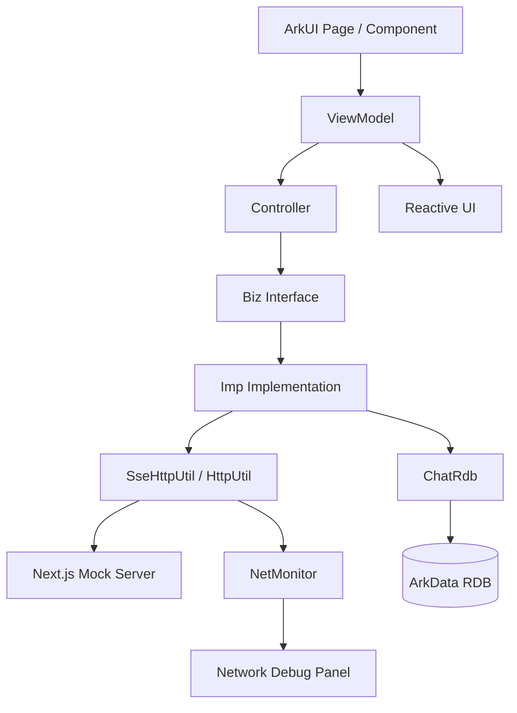
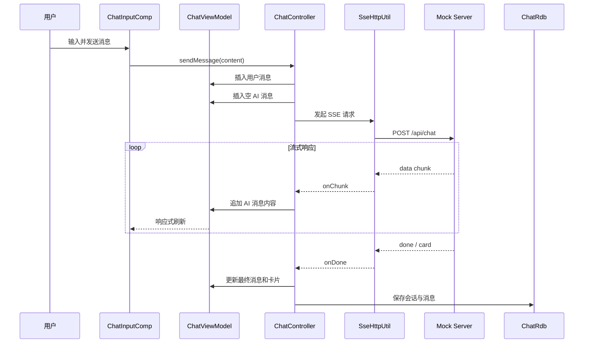
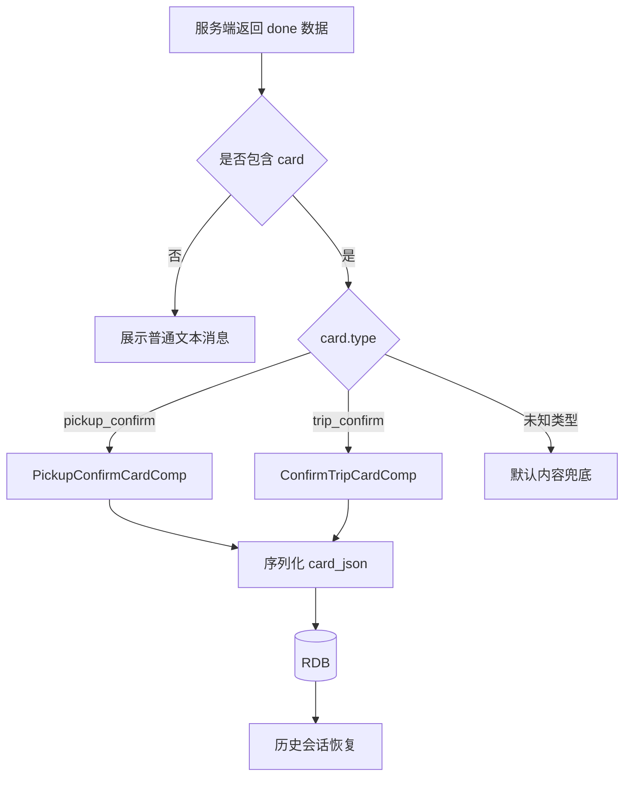

# Harmony Chat Demo

> 基于 HarmonyOS、ArkTS 与 ArkUI 开发的原生 AI 聊天练习项目。

本项目以一个完整的 AI 聊天业务为载体，练习 HarmonyOS 原生应用开发中的页面搭建、状态管理、路由导航、网络请求、SSE 流式响应、关系型数据库、主题切换、键盘避让、日志记录和多模块工程设计。

项目不仅支持普通文本聊天，还实现了根据服务端协议动态渲染业务卡片，并将聊天消息、卡片数据和会话信息持久化到 RDB，重新进入应用后仍可恢复完整聊天记录。

---

## 项目简介

Harmony Chat Demo 是一个面向 HarmonyOS 学习和实践的原生聊天应用。

当前项目包含以下完整业务链路：

```text
用户输入消息
    ↓
创建本地用户消息
    ↓
发起 SSE 流式请求
    ↓
逐段更新 AI 回复
    ↓
解析服务端 done 数据
    ↓
根据 type 渲染文本或业务卡片
    ↓
将会话和消息保存到 RDB
    ↓
从历史记录恢复完整聊天内容
```

通过这个项目可以集中练习：

* ArkTS 基础语法与工程组织
* ArkUI 声明式页面开发
* 状态管理 V2
* HMRouter 页面与弹窗路由
* SSE 流式数据解析
* ArkData RDB 数据持久化
* HAR 多模块工程拆分
* 深色模式和全局主题管理
* 键盘监听及页面避让
* HiLog 日志记录
* 应用内网络调试工具
* 动态业务卡片渲染

---

## 功能概览

| 模块    | 当前能力                                             |
| ----- | ------------------------------------------------ |
| 首页    | 三 Tab 页面结构及底部导航                                  |
| 登录    | 模拟账号登录、游客状态、登录路由拦截                               |
| 路由    | 页面路由、Dialog 路由、登录守卫                              |
| AI 聊天 | 普通文本发送、SSE 流式回复、停止生成                             |
| 消息展示  | 用户消息、AI 消息、流式内容实时刷新                              |
| 业务卡片  | 确认上车点卡片、确认行程卡片                                   |
| 卡片协议  | 根据服务端 `type` 字段动态选择组件                            |
| 历史记录  | 会话列表、消息恢复、会话删除                                   |
| 数据持久化 | 使用 ArkData RDB 保存会话、消息和卡片数据                      |
| 状态管理  | `@ComponentV2`、`@ObservedV2`、`@Trace`、`@Monitor` |
| 主题    | 全局主题状态、深色模式适配、颜色集中管理                             |
| 键盘    | 键盘高度监听、页面避让、监听释放                                 |
| 日志    | 使用 HiLog 记录运行和异常信息                               |
| 网络调试  | 应用内 Network 悬浮球、请求列表、SSE 帧详情                     |
| 工程结构  | `entry`、`chat`、`common` 多模块拆分                    |
| 服务端   | Next.js Mock Server，提供登录和聊天接口                    |
| 学习文档  | 项目实现过程、踩坑记录和知识总结                                 |

---

## 项目亮点

### 1. SSE 流式聊天

项目通过 NetworkKit 发起流式请求，并在接收到服务端数据时实时更新 AI 消息。

主要处理内容包括：

* 使用流式请求接收服务端数据
* 使用 `TextDecoder` 解码二进制数据
* 使用缓冲区处理不完整数据帧
* 按照 SSE 空行规则拆分事件
* 解析 `data:` 后的 JSON 数据
* 通过 `onChunk` 持续更新 UI
* 通过 `onDone` 处理最终结果
* 通过 `onError` 统一处理异常
* 支持用户主动停止生成

流式请求过程中，前端会先插入一条空的 AI 消息，然后不断追加服务端返回的文本内容，从而实现逐字生成效果。

---

### 2. 服务端驱动的业务卡片

除了普通文本消息，项目还支持服务端返回结构化卡片数据。

服务端通过 `type` 字段告诉客户端应该展示哪一种卡片：

```json
{
  "type": "pickup_confirm",
  "title": "确认上车点",
  "currentLocation": "香港中国旅行社",
  "points": [
    {
      "name": "香港中国旅行社",
      "distance": "距您约 100 米"
    }
  ]
}
```

客户端收到数据后，根据 `type` 动态选择对应组件：

```text
pickup_confirm
    → PickupConfirmCardComp

trip_confirm
    → ConfirmTripCardComp

未知类型
    → 使用普通文本或默认内容兜底
```

当前已经实现：

* 确认上车点卡片
* 确认行程卡片
* 卡片点击交互
* 卡片数据持久化
* 历史会话中的卡片恢复

卡片不是写死在聊天列表中，而是由服务端协议驱动，便于后续扩展更多业务类型。

---

### 3. RDB 聊天记录持久化

项目已从简单键值存储迁移到 ArkData RDB。

当前主要使用两张数据表：

#### 会话表 `chat_session`

| 字段            | 说明       |
| ------------- | -------- |
| `id`          | 会话唯一标识   |
| `title`       | 会话标题     |
| `preview`     | 最后一条消息预览 |
| `create_time` | 创建时间     |
| `update_time` | 更新时间     |

#### 消息表 `chat_message`

| 字段            | 说明        |
| ------------- | --------- |
| `id`          | 消息唯一标识    |
| `session_id`  | 所属会话 ID   |
| `role`        | 消息角色      |
| `content`     | 消息文本      |
| `create_time` | 创建时间      |
| `card_json`   | 序列化后的卡片数据 |

消息表还建立了会话和时间索引：

```text
idx_msg_session(session_id, create_time)
```

通过 RDB 可以完成：

* 保存聊天会话
* 保存用户和 AI 消息
* 保存结构化卡片
* 按时间恢复历史消息
* 更新会话标题与预览
* 删除会话及其关联消息
* 应用重新启动后恢复聊天状态

---

### 4. 状态管理 V2

项目使用 HarmonyOS 状态管理 V2 构建聊天状态。

主要使用：

```text
@ComponentV2
@ObservedV2
@Trace
@Monitor
@Provider
@Consumer
```

其中：

* `@ComponentV2` 用于声明 V2 组件
* `@ObservedV2` 用于声明可观察对象
* `@Trace` 用于追踪对象内部字段变化
* `@Monitor` 用于监听状态变化
* `@Provider` 和 `@Consumer` 用于跨组件共享状态

聊天页面不会直接手动刷新，而是通过状态变化驱动组件重新渲染。

---

### 5. 多模块与分层设计

项目主要拆分为三个 HarmonyOS 模块：

```text
entry
├── 应用入口
├── 首页
├── 登录
├── 路由注册
└── Ability 生命周期

chat
├── 聊天页面
├── 聊天组件
├── 聊天状态
├── 会话管理
├── 卡片组件
└── RDB 持久化

common
├── 网络请求
├── SSE 工具
├── 路由工具
├── 日志工具
├── 键盘工具
├── 窗口工具
├── 全局主题
└── Network 调试面板
```

业务代码进一步按照职责拆分：

```text
Page / Component
       ↓
ViewModel
       ↓
Controller
       ↓
Biz
       ↓
Imp
       ↓
Network / RDB
```

各层主要职责：

| 层级         | 职责         |
| ---------- | ---------- |
| Page       | 页面结构和路由参数  |
| Component  | UI 展示与用户事件 |
| ViewModel  | 页面状态和响应式数据 |
| Controller | 业务流程调度     |
| Biz        | 业务接口定义     |
| Imp        | 业务接口实现     |
| Utils      | 通用工具能力     |
| RDB        | 会话与消息持久化   |

---

### 6. 应用内 Network 调试面板

为了方便真机调试，项目实现了一个应用内 Network 面板。

Debug 环境下可以通过悬浮球查看：

* 请求方法
* 请求路径
* 请求状态
* 请求耗时
* 请求参数
* 普通响应内容
* SSE 帧数量
* 每一帧 SSE 数据
* 拼接后的完整回复
* `done` 帧中的卡片数据
* 网络异常信息

它主要解决真机开发过程中无法像浏览器一样直接打开开发者工具查看请求的问题。

网络请求仍然由原有的 `HttpUtil` 和 `SseHttpUtil` 发起，Network 面板只负责监听和展示调试信息，不侵入具体业务组件。

---

### 7. 全局主题和深色模式

项目将页面中的硬编码颜色逐步集中到全局主题状态中。

主要目标：

* 统一页面颜色语义
* 减少组件内重复色值
* 支持浅色和深色主题
* 响应系统配置变化
* 避免每个组件单独判断当前主题

组件通过主题状态读取背景色、文字颜色、分割线颜色和卡片颜色，便于后续统一维护。

部分需要严格还原设计稿的业务卡片，会保留独立的品牌色和固定视觉参数。

---

### 8. 键盘避让与生命周期处理

聊天页面包含输入框，因此需要处理软键盘弹出后的布局变化。

项目封装了键盘控制逻辑，用于：

* 获取键盘高度
* 监听键盘显示和隐藏
* 调整聊天页面布局
* 避免输入框被键盘遮挡
* 页面退出时释放监听
* 防止重复注册造成内存泄漏

---

### 9. HiLog 日志

项目使用 HiLog 替换普通控制台日志。

日志主要用于记录：

* 页面生命周期
* 登录流程
* 路由跳转
* 网络请求
* SSE 接收状态
* 数据库初始化
* 数据保存与读取
* 异常信息

日志工具集中封装在 `common` 模块，业务代码通过统一入口输出日志，方便后续按照 domain 和 tag 过滤。

---

## 核心架构



---

## 消息发送流程



---

## 卡片渲染流程



---

## 数据持久化流程

聊天页面中的 `ChatMessage` 是带有响应式能力的 UI 模型，不适合直接写入数据库。

因此项目在持久化前会将其转换为普通数据对象：

```text
ChatMessage
    ↓ 转换
ChatMessagePlain
    ↓ 序列化卡片
RDB Row
```

恢复历史记录时执行相反流程：

```text
RDB Row
    ↓ 解析 card_json
ChatMessagePlain
    ↓ 恢复响应式模型
ChatMessage
    ↓
聊天列表重新渲染
```

这样可以将 UI 响应式状态与数据库模型解耦。

---

## 技术栈

| 分类    | 技术                         |
| ----- | -------------------------- |
| 开发语言  | ArkTS、TypeScript           |
| UI 框架 | ArkUI                      |
| 应用模型  | Stage Model                |
| 状态管理  | 状态管理 V2                    |
| 路由    | HMRouter                   |
| 网络    | NetworkKit、SSE             |
| 数据库   | ArkData RelationalStore    |
| 本地状态  | AppStorageV2、PersistenceV2 |
| 日志    | HiLog                      |
| 工程模块  | HAP、HAR                    |
| 服务端   | Next.js                    |
| 包管理   | npm、ohpm                   |
| 开发工具  | DevEco Studio              |

---

## 项目目录

```text
harmony-chat-demo
├── AppScope
│   └── 应用级资源和配置
│
├── entry
│   └── src/main/ets
│       ├── biz
│       ├── components
│       ├── constants
│       ├── controller
│       ├── dialogs
│       ├── entryability
│       ├── entrybackupability
│       ├── imp
│       ├── interceptors
│       ├── models
│       ├── pages
│       ├── utils
│       └── viewmodel
│
├── chat
│   └── src/main/ets
│       ├── biz
│       ├── components
│       │   ├── ChatInputComp.ets
│       │   ├── ChatListComp.ets
│       │   ├── ChatTabComp.ets
│       │   ├── PickupConfirmCardComp.ets
│       │   └── ConfirmTripCardComp.ets
│       ├── constants
│       ├── controller
│       │   ├── ChatController.ets
│       │   ├── ChatHistoryController.ets
│       │   └── ChatSessionController.ets
│       ├── imp
│       ├── models
│       │   └── chatModel.ets
│       ├── pages
│       │   ├── ChatPage.ets
│       │   └── ChatHistoryPage.ets
│       ├── utils
│       │   ├── ChatPersist.ets
│       │   └── ChatRdb.ets
│       └── viewmodel
│           ├── ChatLoadState.ets
│           └── ChatViewModel.ets
│
├── common
│   └── src/main/ets
│       ├── constants
│       ├── debug
│       │   ├── NetMonitor.ets
│       │   └── NetMonitorPanel.ets
│       ├── models
│       ├── utils
│       │   ├── HMUtil.ets
│       │   ├── HttpUtil.ets
│       │   ├── KeyboardController.ets
│       │   ├── LogUtil.ets
│       │   ├── SseHttpUtil.ets
│       │   └── WindowUtil.ets
│       └── viewmodel
│
├── server
│   ├── app
│   │   └── api
│   │       ├── chat
│   │       ├── login
│   │       └── products
│   └── package.json
│
├── docs
│   └── 项目学习文档和实现记录
│
├── build-profile.json5
├── oh-package.json5
└── README.md
```

---

## 模块依赖关系

```text
entry
├── 依赖 chat
└── 依赖 common

chat
└── 依赖 common

common
└── 不依赖具体业务模块
```

`common` 只提供通用能力，不能反向依赖 `entry` 或 `chat`，避免形成循环依赖。

---

## 运行项目

### 1. 环境准备

需要准备：

* DevEco Studio
* HarmonyOS SDK
* Node.js
* npm
* HarmonyOS 模拟器或真机

建议确保电脑和真机连接到同一个局域网。

---

### 2. 克隆项目

```bash
git clone https://github.com/lichenyang5/harmony-chat-demo.git
cd harmony-chat-demo
```

---

### 3. 安装 HarmonyOS 依赖

使用 DevEco Studio 打开项目后，等待 IDE 自动同步。

也可以在项目根目录执行：

```bash
ohpm install
```

---

### 4. 启动 Mock Server

进入服务端目录：

```bash
cd server
```

安装依赖：

```bash
npm install
```

启动开发服务器：

```bash
npm run dev
```

默认服务地址：

```text
http://localhost:3000
```

---

### 5. 修改客户端服务地址

打开：

```text
common/src/main/ets/constants/ApiConstants.ets
```

将服务地址修改为电脑在局域网中的 IPv4 地址：

```ts
export class ApiConstants {
  static readonly BASE_URL: string = 'http://192.168.x.x:3000'
}
```

真机不能通过下面的地址访问电脑服务：

```text
http://localhost:3000
```

因为真机中的 `localhost` 指向手机自身。

可以在 Windows PowerShell 中执行以下命令查看电脑 IPv4 地址：

```powershell
ipconfig
```

找到当前网络适配器对应的 IPv4 地址后，再填入 `BASE_URL`。

---

### 6. 运行 HarmonyOS 应用

在 DevEco Studio 中：

1. 选择 `entry` 模块。
2. 连接模拟器或 HarmonyOS 真机。
3. 点击运行按钮。
4. 等待应用安装并启动。

---

## 测试账号

当前登录功能使用本地 Mock Server。

```text
账号：admin
密码：123456
```

登录仅用于演示路由拦截和登录状态，不代表生产环境鉴权方案。

---

## 演示流程

### 普通聊天

1. 进入 AI 聊天页面。
2. 输入一段普通文本。
3. 点击发送。
4. 观察 AI 内容逐段显示。
5. 在生成过程中点击停止按钮。
6. 重新发送消息，观察新的 SSE 请求。

---

### 打车卡片

在输入框中输入：

```text
打车
```

服务端会返回打车相关的流式文本和结构化卡片。

演示内容包括：

```text
输入“打车”
    ↓
显示流式文字
    ↓
展示确认上车点卡片
    ↓
选择上车点
    ↓
展示确认行程卡片
```

---

### 历史记录

1. 完成一次普通聊天或打车卡片对话。
2. 离开当前聊天页面。
3. 打开历史记录。
4. 选择刚才的会话。
5. 检查文字消息和卡片是否正确恢复。
6. 删除会话，检查关联消息是否同步删除。

---

### Network 调试面板

在 Debug 构建中：

1. 打开应用内 Network 悬浮球。
2. 发送一条聊天消息。
3. 在请求列表中选择对应请求。
4. 查看请求参数。
5. 查看逐帧 SSE 数据。
6. 查看最终拼接内容。
7. 查看 `done` 帧中的卡片数据。
8. 主动关闭服务端，观察异常信息。

---

## Mock API

### 登录

```http
POST /api/login
Content-Type: application/json
```

请求示例：

```json
{
  "username": "admin",
  "password": "123456"
}
```

---

### AI 聊天

```http
POST /api/chat
Content-Type: application/json
```

请求示例：

```json
{
  "inputContent": "打车"
}
```

接口返回 SSE 数据：

```text
data: {"chunk":"正在为你查找附近的上车点"}

data: {"chunk":"..."}

data: {"done":true,"card":{"type":"pickup_confirm"}}
```

客户端会持续解析 `chunk`，并在 `done` 帧到达后处理最终消息和卡片数据。

---

## 常见问题

### 1. 真机无法访问 Mock Server

请依次检查：

* 手机和电脑是否连接同一网络
* `BASE_URL` 是否填写电脑 IPv4 地址
* 服务端是否已经启动
* Windows 防火墙是否允许 Node.js 访问网络
* 手机浏览器是否能打开电脑的服务地址
* 当前端口是否被其他程序占用

---

### 2. 请求成功但没有流式效果

请检查：

* 服务端是否按照 SSE 格式返回数据
* 每个事件之间是否存在空行
* 数据是否以 `data:` 开头
* `SseHttpUtil` 是否正确保留未解析完成的 buffer
* 是否提前执行了请求销毁
* Network 调试面板中是否收到 SSE 帧

---

### 3. 卡片没有显示

请检查：

* `done` 数据中是否包含 `card`
* `card.type` 是否为客户端支持的类型
* 卡片 JSON 是否能够正常解析
* 聊天列表是否根据消息的 `card` 字段分发组件
* 未知卡片类型是否进入了兜底逻辑

---

### 4. 历史消息没有恢复

请检查：

* `ChatRdb.init()` 是否在应用启动阶段执行
* 当前会话是否已经持久化
* `session_id` 是否一致
* `card_json` 是否为合法 JSON
* 数据库查询结果是否正确转换为 `ChatMessage`
* 当前安装包是否保留了旧版本数据库结构

开发阶段遇到数据库结构不一致时，可以清除应用数据后重新运行。

---

### 5. 键盘弹出后输入框被遮挡

请检查：

* 页面是否正确监听键盘高度
* 窗口是否使用了合适的避让模式
* 页面退出时是否错误释放了监听
* 同一个页面是否重复注册了监听器

---

## 学习文档

项目的开发过程和知识总结保存在 `docs` 目录。

推荐阅读：

* [AI 聊天页面完整实现](./docs/13-harmony-chat-demo-ai-chat-blog.md)
* [SSE 卡片协议与持久化](./docs/17-ai-chat-pickup-card-sse-persistence.md)
* [Stage Model 与 Ability](./docs/19-harmonyos-stage-model-ability-page.md)
* [HiLog 日志改造](./docs/23-harmony-chat-demo-hilog.md)
* [深色模式与系统主题](./docs/24-arkts-resources-dark-mode-follow-system.md)
* [硬编码颜色迁移到主题系统](./docs/25-arkts-hardcoded-colors-into-theme-system.md)
* [RDB 聊天记录持久化](./docs/25-arkts-rdb-chat-persistence.md)
* [应用内 Network 调试面板](./docs/26-in-app-network-monitor-sse-devtools.md)

---

## 可以重点学习的实现

### SSE 为什么需要 buffer

网络层每次收到的数据不一定是一条完整消息。

可能出现：

```text
第一次收到：
data: {"chunk":"你

第二次收到：
好"}
```

也可能一次收到多条：

```text
data: {"chunk":"你"}

data: {"chunk":"好"}
```

因此不能把每一次回调都直接当成完整 JSON 解析，必须先放入 buffer，再根据 SSE 分隔规则提取完整事件。

---

### 为什么先创建空的 AI 消息

如果每收到一个 chunk 都重新插入一条消息，聊天列表会产生大量碎片消息。

项目会先创建一条空 AI 消息：

```text
content = ""
```

后续所有 chunk 都追加到同一个对象：

```text
"你"
"你好"
"你好，我"
"你好，我是"
```

借助 `@ObservedV2` 和 `@Trace`，对象字段变化后 UI 会自动刷新。

---

### 为什么使用 RDB 而不是 Preferences

Preferences 更适合：

* 简单配置
* 开关状态
* 少量键值数据

聊天记录具有：

* 多会话
* 多消息
* 一对多关系
* 排序查询
* 删除和更新
* 数据量持续增长

因此关系型数据库更适合当前业务。

---

### 为什么拆分 Controller、Biz 和 Imp

如果网络请求、状态修改、数据库保存和 UI 代码全部写在组件中，会导致：

* 组件体积过大
* 业务逻辑难以复用
* 异常处理分散
* 测试困难
* 页面和数据层强耦合

分层后：

* Component 负责显示
* ViewModel 负责状态
* Controller 负责流程
* Biz 定义能力
* Imp 负责具体实现
* Utils 提供通用工具

---

## 当前限制

本项目目前主要用于 HarmonyOS 学习和功能验证，仍存在以下限制：

1. AI 内容来自本地 Mock Server，未接入真实大模型。
2. 登录功能属于模拟登录，不是生产级认证系统。
3. 打车地点、距离和价格主要使用模拟数据。
4. 当前主要针对手机布局，尚未完成平板双栏适配。
5. 消息失败状态、自动重试和重新生成仍可继续完善。
6. 当前数据库保存策略以完成一次回复后集中持久化为主。
7. Network 调试面板仅用于开发调试，不应直接用于正式发布版本。
8. 项目暂未覆盖完整的自动化测试。

---

## 后续计划

* [ ] 增加消息发送中、生成中、成功、失败和停止状态
* [ ] 增加失败消息重新发送
* [ ] 增加 AI 回复重新生成
* [ ] 接入 Location Kit 获取当前位置
* [ ] 将真实定位结果接入确认上车点卡片
* [ ] 增加 PhotoPicker 图片消息
* [ ] 增加图片预览页面
* [ ] 增加聊天消息长按菜单
* [ ] 增加草稿保存和恢复
* [ ] 增加 AI 回复完成通知
* [ ] 增加平板和横屏双栏布局
* [ ] 为 SSE Parser 和 RDB 增加单元测试
* [ ] 增加国际化和无障碍适配
* [ ] 探索服务卡片、实况窗和跨设备接续

---

## 项目能力总结

通过当前项目已经实践：

```text
ArkTS
ArkUI
Stage Model
UIAbility 生命周期
状态管理 V2
HMRouter
HAR 模块化
NetworkKit
SSE 流式解析
ArkData RDB
AppStorageV2
PersistenceV2
HiLog
主题和深色模式
键盘避让
服务端协议驱动 UI
应用内网络调试
Next.js Mock Server
```

这个项目仍在持续学习和完善中，重点不是实现一个完整商业产品，而是通过真实业务场景理解 HarmonyOS 原生应用的开发流程、架构设计和问题排查方式。

---

## 说明

本项目为个人 HarmonyOS 学习与技术实践项目，代码和文档仅供学习交流使用。

部分页面样式和接口数据属于 Demo 演示内容，不代表正式商业实现。
